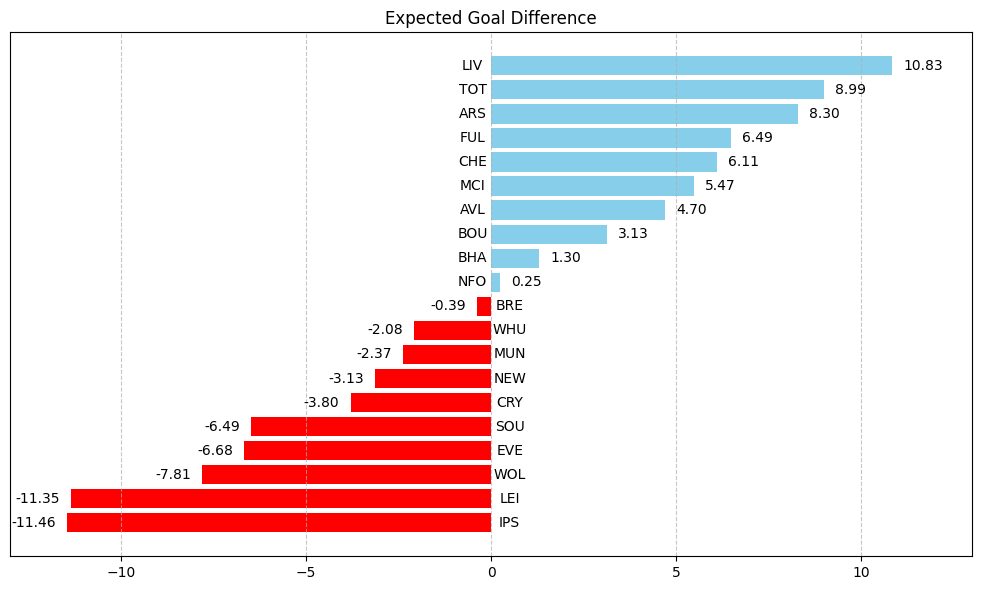

# Premier-League-Analysis

With no Premier League games to look forward to this weekend, I decided to analyze the current Premier League scenario using data visualization with Python. Looking forward to your feedback and suggestions!

Some of the eye-catching performances:
• Fulham, under Marco Silva, have recruited smartly in the last couple of windows, making a cohesive front-footed team with a band of Premier League-proven players. Their xGD is currently fourth in the league owing to some impressive displays from their attacking players, bar Adama Traore, who was guilty of missing a couple of easy chances against Manchester City.

• Speaking of Manchester City, despite outperforming their xPts total more than any other team in the league, their xGD isn’t that promising, which makes you wonder about the defensive frailty without the presence of Rodri shielding their back line and a certain lack of a killer ball in the absence of De Bruyne.

• Arsenal and Spurs have almost the same xGD but are polar opposites in the xPts front because both Solanke and Havertz have underperformed on their xG devoid of clinical edge whilst leading the line in attack, but Arsenal more than compensate this using their set piece supremacy and are equipped with the meanest defense of last season, which is the point of contrast with Spurs.

Not so spectacular yet impressive feats:
• Haaland, being the monster he is, has outperformed his xG by the greatest margin among all players; we’re being treated to such clinical displays from him that it is no longer surprising or unexpected.

• Cole Palmer continues to produce magic out of nothing, with a stunning free kick and cheeky lobs from far adding to his total; he continues to exceed his xG, and having the ability to spot runners around him when closed upon makes him a force to be reckoned with.

• Liverpool sitting atop the league after the departure of Klopp was not predicted by all, but the scintillating form of Mo Salah and improved performances from the midfielders and Luis Diaz have aided Arne Slot. As you can see from their shot map, Liverpool players aren’t afraid to have a go from long distance when the opposition defense is compact, but the issue is that they haven’t scored any goal from range.

• Liverpool is leading in the xGD table too due to their relatively easy fixtures to begin the campaign with. Arne Slot has embedded his brand of football into the players, making them click at every turn so far with the exception of the Nottingham game. 

After seven games being played till now, there is little to nothing separating the leaders from the pack. This season promises to be an intriguing one, with many teams investing in the squad and not necessarily the playing XI indicating the preparedness if the injury bug hits them.

The above mentioned details can be found [here](https://www.linkedin.com/posts/anoosh-solayappan_with-no-premier-league-games-to-look-forward-activity-7251221509468233729-kOXA?utm_source=share&utm_medium=member_desktop).

